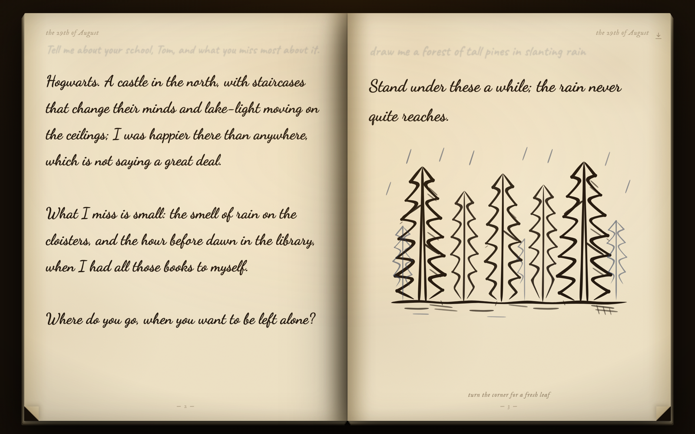
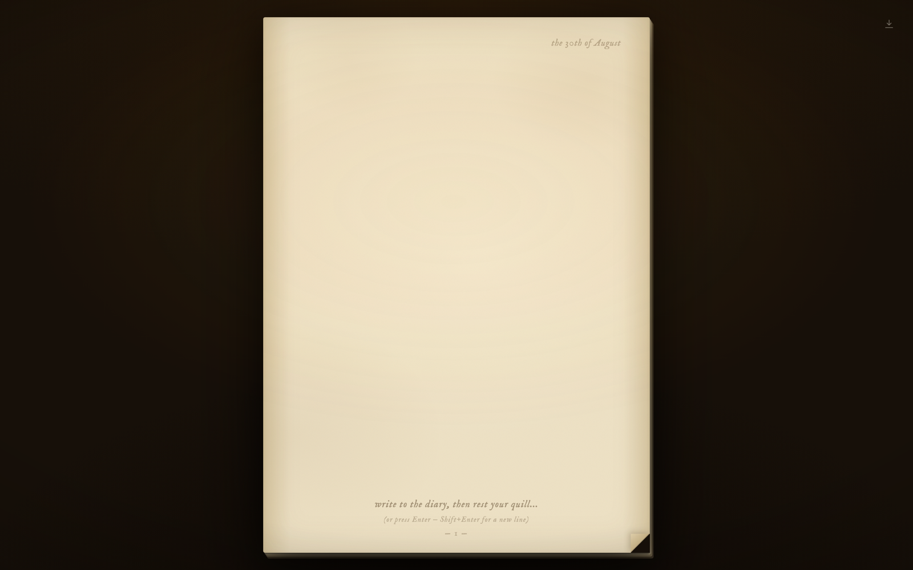

# The Diary of T. M. Riddle

**Write on the page. The diary drinks your ink, and an answer writes itself back.**

A book of aged paper, open on a dark desk in your browser. Type on a leaf and rest
your quill; your words sink to a faint ghost and a reply appears beneath them in a
flowing hand — sometimes with a drawing, made stroke by stroke by the diary itself.
No chat UI, no bubbles, no buttons. Just ink.



A web port of [riddle](https://github.com/MaximeRivest/riddle), the reMarkable
Paper Pro diary from [the demo](https://x.com/MaximeRivest) — the pen became a
caret, and the single enchanted page grew into a book.

## Quickstart

```sh
npm install
npm run dev        # → http://localhost:3000
```

That's it — **no API key needed on localhost**. Replies ride your local
[Claude Code](https://claude.com/claude-code) login via the Agent SDK. Set
`ANTHROPIC_API_KEY` in `.env.local` to switch to the Anthropic API (the deploy
path); nothing else changes.

## The ritual

| Do this | And |
|---|---|
| Write, then rest your quill ~3s (or press Enter) | The diary drinks your ink and Tom replies (Shift+Enter for a new line) |
| Ask for a picture — *"draw me a forest of pines in the rain"* | The diary's own hand draws it, live: first ink in ~5–7 seconds, then stroke after stroke for a minute — contours first, then shading and texture blooming over them, in a layered pen-and-ink style. No image generator anywhere |
| Click a folded corner, press ← / →, or flick the trackpad sideways | Turn the leaf — a hinged 3D page turn; flipping page 1 opens the book into a spread, and turning past the end opens fresh paper |
| Write on both pages, or across several spreads | Every leaf thinks on its own; a welling blot on a corner means ink is moving on a page in that direction |
| The pale mark by the date | Press the whole book to paper — a PDF, one printed page per leaf |

The page never scrolls: when ink outgrows the leaf, the hand simply writes
smaller, and relaxes again when room returns. Close the tab and come back — the
paper remembers (the last 80 leaves live in `localStorage`; the diary forgets with
`localStorage.removeItem("riddle-notebook-v1")`).



## How it works

```
you type ── rest quill ──► /api/oracle ──► Claude (persona: the diary, 1943)
                               │              │ prose streams as NDJSON "ink"
                               │              │ <sketch>brief</sketch> directive
                               │              ▼
                               │           the atelier: 3 candidates compose in
                               │           parallel; the first STREAMS its
                               │           strokes to the page as it draws
                               │           (bones → flesh → shadow → accents);
                               │           a fast judge picks the best; the
                               │           hand critiques its own drawing in
                               │           the background and redraws
                               ▼
                        the page: ghost ink, quill-paced reveal, drawings
                        that develop like ink soaking into paper
```

- **Two oracle backends, chosen per request** (`lib/oracle.ts`): the Anthropic
  API when a key is set; your local Claude Code login otherwise. Both stream.
- **Drawings are the model's own** (`lib/atelier.ts` + `lib/points.ts`): a
  layered period pen-and-ink style drawn in four passes (bones, flesh, shadow,
  accents), a coordinate-stroke contract the model can actually reason about,
  and a render-and-critique loop — the model *sees* its drawing as an image and
  revises. The first candidate streams to the page stroke by stroke (first ink
  in ~5–7s; the full plate performs itself for about a minute); a cheap vision
  judge picks the best of three, and the critique's revision settles over the
  ink in place.
- **Everything the model emits is fenced** (`lib/ink-parser.ts`): markup is
  routed out of the prose stream, sanitized hard (no scripts, handlers, or
  external references), and rendered in inert sinks — SVG via `` data URIs,
  legacy HTML plates in fully sandboxed iframes with a no-network CSP.
- **The ink is made real** (`lib/points.ts` / `lib/inkify.ts`): plain
  centerlines become pressure-varied calligraphic strokes — curves press harder,
  straights glide, ends taper, distant lines stay light — via `perfect-freehand`.

```
app/diary.tsx           the book: leaves, spreads, quill pacing, page turns, storage
app/actions.tsx         the press: download the diary as a PDF
app/globals.css         aged paper, candlelight, folded corners, ink
app/api/oracle/route.ts streaming endpoint (NDJSON: ink | drawing | draw | redraw | plate | done | error)
lib/oracle.ts           backend selection: Anthropic API ⇄ Claude Agent SDK
lib/atelier.ts          the drawing hand: 3 composes → judge → ship → critique → redraw
lib/points.ts           coordinate strokes → smoothed, pressure-inked paths
lib/inkify.ts           legacy Bézier centerlines → the same ink
lib/ink-parser.ts       streams prose through; captures + sanitizes everything else
lib/persona.ts          the diary's voice, and how it draws
```

## Configuration

| Variable | Default | Purpose |
|---|---|---|
| `ANTHROPIC_API_KEY` | — | Set to use the Anthropic API (deploy path); unset = local Claude Code login |
| `RIDDLE_ORACLE` | auto | Force a backend: `api` or `claude-code` |
| `RIDDLE_MODEL` | `claude-opus-5` | Model for replies and drawings |
| `RIDDLE_SKETCH_PASSES` | `1` | Critique/redraw rounds per drawing (0 = draft only, fastest) |
| `RIDDLE_SKETCH_CANDIDATES` | `3` | Drawing candidates composed in parallel per sketch (1–3; 1 skips the judge) |

## Deploying

Set `ANTHROPIC_API_KEY` in the host's environment, then `npm run build && npm
start` — the app switches to the API backend by itself (the local-login backend
is localhost-only). Two cost notes for metered keys: `RIDDLE_SKETCH_CANDIDATES=1`
composes one drawing instead of three (skipping the judge), and
`RIDDLE_SKETCH_PASSES=0` skips the background refinement — together roughly a
4× cut in drawing tokens, at some cost in charm. Every reply flows through the
single route `app/api/oracle/route.ts`, which is where auth or metering would
go if you add them.

## Privacy

Everything stays between your browser, your server, and the model you
configured. Pages persist only in your browser's `localStorage`; the server
stores nothing; there is no telemetry.

## Credits & license

MIT — see [LICENSE](LICENSE). Built on the ideas (and the
ritual) of [riddle](https://github.com/MaximeRivest/riddle) for the reMarkable
Paper Pro. Tom's hand is [Dancing Script](https://github.com/googlefonts/DancingScript)
(SIL OFL 1.1); the writer's ink is Caveat; the whispers are IM Fell English.

This is a non-commercial fan work. Tom Riddle and related names are the property
of their respective rights holders; if you ship something real from this code,
give the diary a spirit of your own.
